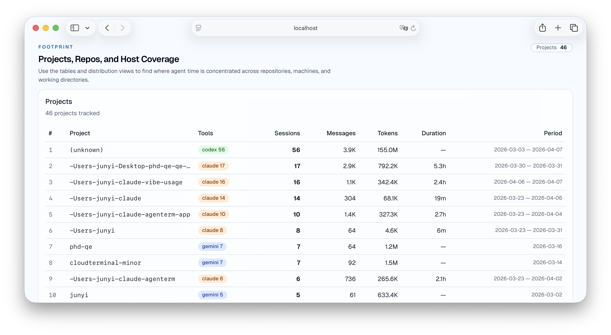
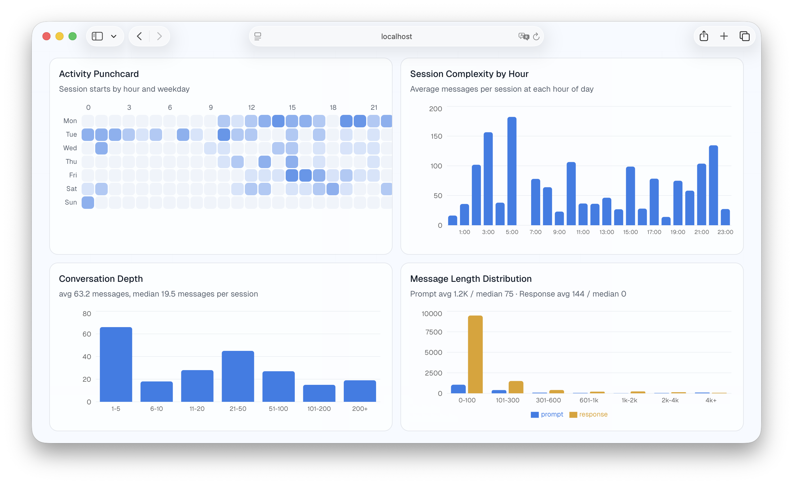

# vibe-usage

Collects conversation data from multiple AI coding tools, maps them to a unified schema, and serves a web dashboard for analysis.

Single binary, written by Rust.

## Screenshots


<p align="center">
  
  
  
  
</p>

## Install

```bash
brew tap cross-entropy-ai/tap
brew install vibe-usage
```

Or download pre-built binaries from [GitHub Releases](https://github.com/cross-entropy-ai/vibe-usage/releases).

## Supported Tools

| Tool | Data Location | Format |
|------|--------------|--------|
| Gemini CLI | `~/.gemini/tmp/<project>/chats/*.json` | JSON |
| Claude Code | `~/.claude/projects/<project>/*.jsonl` | JSONL |
| OpenAI Codex | `~/.codex/sessions/YYYY/MM/DD/*.jsonl` | JSONL |
| Kimi Code | `~/.kimi/sessions/<hash>/<uuid>/context.jsonl` | JSONL |

## Build from Source

See [`docs/build-from-source.md`](docs/build-from-source.md).

## Usage

```bash
# Default: sync local data + print summary
vibe-usage

# Subcommands
vibe-usage sync                        # copy raw files to ~/.vibe-usage/raw/<hostname>/
vibe-usage analyze --summary           # parse from local copy, print stats
vibe-usage analyze -o all.json         # export full JSON
vibe-usage analyze -t claude --summary # specific tools only
vibe-usage serve                       # start web dashboard on :3000
vibe-usage serve -p 8080               # custom port
vibe-usage push                        # rsync local data to remote server
vibe-usage pull                        # rsync all data from remote server

# Global flags
-t, --tools <gemini,claude,codex,kimi> # filter tools (default: all)
-d, --data-dir <path>                  # data directory (default: ~/.vibe-usage)
```

## Configuration

`~/.vibe-usage/config.toml`:

```toml
remote = "user@host:~/.vibe-usage"

# Subscription-based tools (flat monthly, not per-token)
[[subscriptions]]
tool = "claude"
plan = "Team"
monthly_usd = 30.0

[[subscriptions]]
tool = "codex"
plan = "Plus"
monthly_usd = 20.0
```

## Data Layout

```
~/.vibe-usage/
├── config.toml
└── raw/
    └── <hostname>/        # one dir per machine
        ├── gemini/        # raw copies from each tool
        ├── claude/
        ├── codex/
        └── kimi/
```

Raw files are copied incrementally (mtime-based skip). Multiple machines can push to the same remote, each under their own hostname directory.

## Web Dashboard

See [`docs/web-dashboard.md`](docs/web-dashboard.md).

## Release

See [`docs/release.md`](docs/release.md).

## Architecture

See [`docs/architecture.md`](docs/architecture.md).
