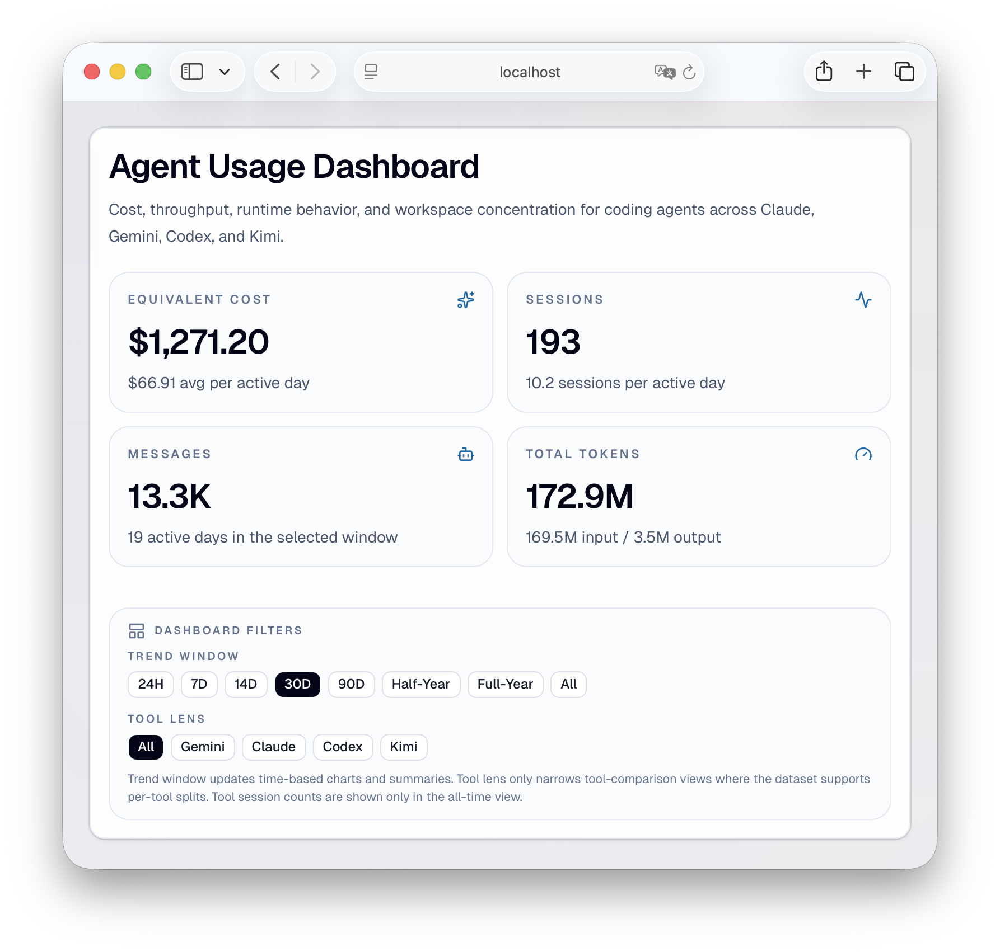
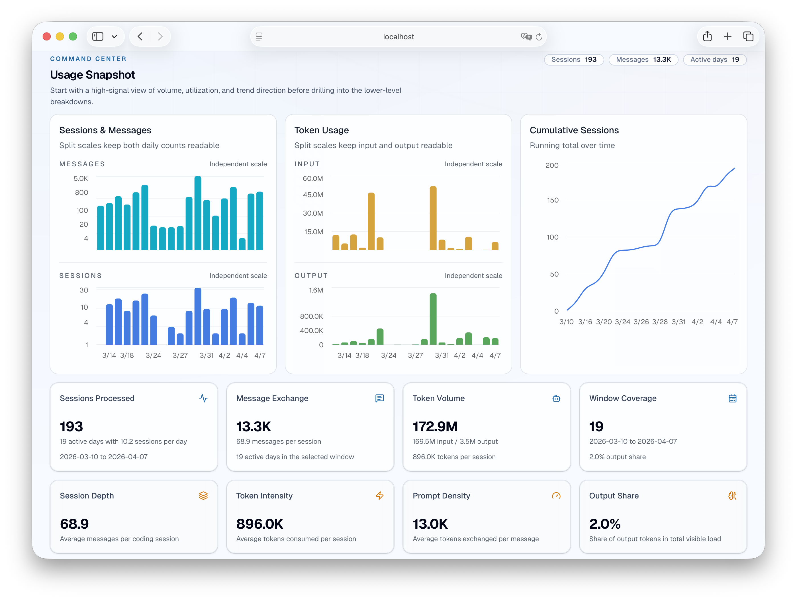
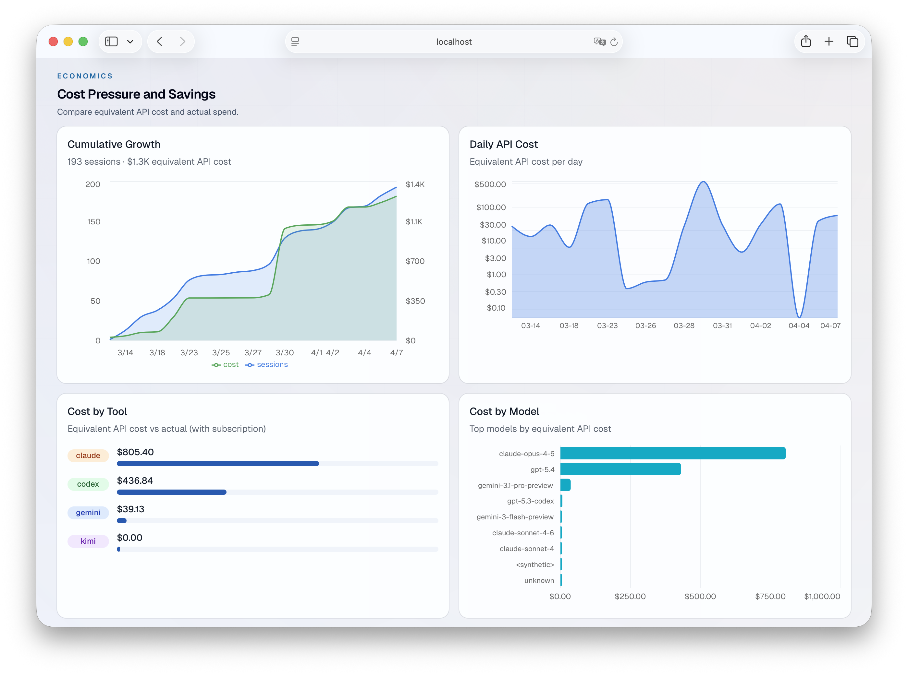

# vibe-usage

[](https://github.com/cross-entropy-ai/vibe-usage/releases)
[](https://github.com/cross-entropy-ai/vibe-usage/actions/workflows/release.yml)
[](https://github.com/cross-entropy-ai/vibe-usage/releases)

Local-first usage analytics for AI coding tools.

- Single binary (Rust), no database required
- Unified stats across Gemini CLI, Claude Code, OpenAI Codex, and Kimi Code
- Dashboard for usage, cost, projects, and activity

## Screenshots



<p align="center">
  
  
  
</p>

## Install

```bash
brew tap cross-entropy-ai/tap
brew install vibe-usage
```

Or download pre-built binaries from [GitHub Releases](https://github.com/cross-entropy-ai/vibe-usage/releases).

Build from source: [docs/build-from-source.md](docs/build-from-source.md)

## Quick Start

```bash
vibe-usage sync          # collect local raw files
vibe-usage serve         # open dashboard on :3000
vibe-usage serve -p 8080 # custom port
```

## Data Directory

Default data directory is `~/.vibe-usage`.

If you do not want to use `~/.vibe-usage`, choose your own directory.

```bash
# per command
vibe-usage sync --data-dir ~/data/vibe

# persistent default
export VIBE_USAGE_DATA_DIR=~/data/vibe
```

## Next Docs

- Advanced sync / remote setup: [docs/advanced-usage.md](docs/advanced-usage.md)
- Dashboard/API endpoint details: [docs/web-dashboard.md](docs/web-dashboard.md)
- Build and release notes: [docs/release.md](docs/release.md)
- Data model and internals: [docs/architecture.md](docs/architecture.md)